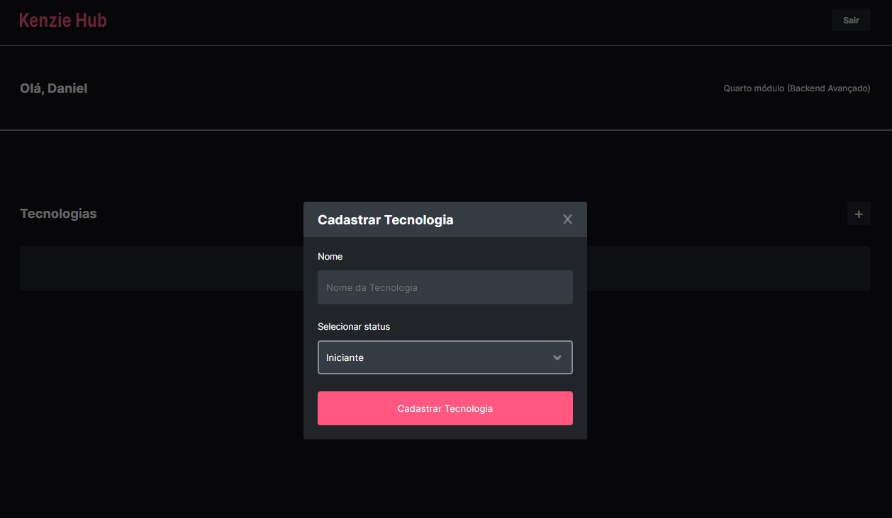

# KenzieHub



## Descrição

Projeto com cadastro e login de usuários, que autenticados, podem criar uma lista de tecnologias, e selecionar editando o nível atual de conhecimento em cada tecnologia.


### Deploy
Aplicação em produção: [https://kenzie-hub-ten-chi.vercel.app/](https://kenzie-hub-ten-chi.vercel.app/)


## Tecnologias Utilizadas
<div>
  
  
  
  
  
</div>

## Funcionalidades
- **Autologin e Proteção de Rotas:** Implementação do autologin para proteger rotas. Usuários não logados não podem acessar a dashboard.
- **Edição de Tecnologias:** Funcionalidade para usuários logados editar o status das tecnologias.
  - Alteração do status da tecnologia.
  - Não é possível alterar o título da tecnologia.
  - Modal para edição da tecnologia.
  - Toasts para feedback de sucesso ou erro durante as ações.


## Executando o Projeto

### Pré-requisitos
Certifique-se de ter o Node.js instalado.

### Instalação das Dependências
No terminal, execute o seguinte comando para instalar as dependências:

```bash
npm install
```
### Rodando o Projeto
Para iniciar o projeto, utilize o comando:

```bash
npm run start
```

## Contato
Se tiver dúvidas ou precisar de mais informações, sinta-se à vontade para entrar em contato:
- Email : [contato@daanrox.com](mailto:contato@daanrox.com)
- LinkedIn: [https://www.linkedin.com/in/daanrox/](Daanrox)

--- 

"Consagre ao Senhor tudo o que você faz, e os seus planos serão bem-sucedidos."


